<div align="center">



<br />

[](https://uobo.com.au)
[](https://voxfra.io)
[](https://syntreon.io)
[](https://linkedin.com/in/sidambili)

</div>


```text
sid@london:~$ whoami
Sid Ambili. Founder of Syntreon. London, Ontario.

sid@london:~$ cat focus.txt
Agents that do real operational work: answer the phone, capture the
details, hand the right context to the right person. I start with the
business workflow, then build the software around it.
```


## What I'm building

| Project | What it does | Status |
| :-- | :-- | :-- |
| **[Uobo](https://uobo.com.au)** | AI agents for automotive operations. Voice and messaging agents that handle inbound calls, capture leads, and keep service and sales teams in the loop. | Active |
| **[Voxfra](https://voxfra.io)** | Infrastructure for running voice AI at scale. Multi-tenant, built for agencies and operators managing many clients and locations. | Building |

Both are commercial products built under [Syntreon](https://syntreon.io).

<br />



<br />

## Side project

**Moonga** is an operations intelligence tool. Events from GitHub, Linear and Sentry come in, an AI agent diagnoses incidents or drafts plans, and a human approves before anything goes out. I plan to open source it.

> [!NOTE]
> Side project, but this one's pretty cool.


## Stack

<div align="center">


</div>

<details>
<summary><b>How I build</b></summary>

<br />

1. Find the operational problem
2. Map the workflow before touching code
3. Pick the smallest set of tools that works
4. Let AI write the first pass, then review it
5. Wire the services together
6. Iterate until the business outcome is real

</details>

<br />


